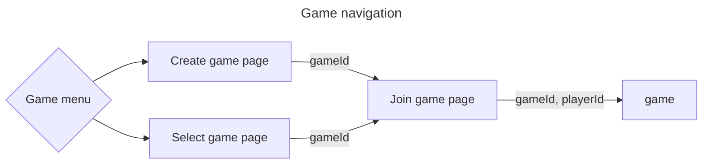
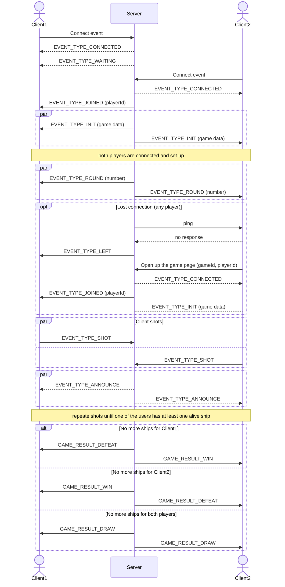

# Battleships

> Battleships (also known as Battleship or Sea Battle) is a strategy type guessing game for two players. It is played on ruled grids (paper or board) on which each player's fleet of warships are marked. The locations of the fleets are concealed from the other player. Players alternate turns calling "shots" at the other player's ships, and the objective of the game is to destroy the opposing player's fleet.
> --  <cite>[Wikipedia](https://en.wikipedia.org/wiki/Battleship_(game))</cite>

It is hosted at http://ec2-3-142-134-11.us-east-2.compute.amazonaws.com:3000/

## Rules

* two players
* there should be at least one cell gap between ships
* the ships combination (number and types) is the same for each player
* both players make a shot each round; there isn't the first and the last who shot

## Game navigation



Main menu offers two options:
* Create game - create new game with desirable settings
* Join game - join an existing game which was created by somebody else

## Create game page

### Game types
* single game - game with a AI
* multiplayer - game with another person
    * public - this game will appear on "Join game" page
    * private - this game won't be visible on "Join game" page (you have to share the link with the opponent)

### Game settings

You can choose between hardcoded and custom game settings values

* board size
* ships configuration - how many and which ships will be in the game

#### Ship types

| Ship | Size |
| -------- | ------- |
| Carrier | 5 |
| Battleship | 4 |
| Destroyer | 3 |
| Patrol Boat | 2 |

## Join game page

Once the game was created it is known information which ships are there and what the board size is. It is time to put the ships in place. You can move them around the board and rotate. Also `Shuffle` feature is available which lets to get randomly placed ships.

## Gameflow



## Engineering

1. There are three tough questions that should be get answered to make the game run:

    a. Does the ships combination make sense for a given grid size?
    We would like to know that the combination meaningless on the game creation stage not when the game started.

    b. Are there more that two possible combinations?
    If players don't have another choice but place the ships the same way it makes the game meaningless.?

    c. How to find a random combination
    Usually there are any millions of different combinations to choose from.

    All those questions are quite computation-intensive, this is why it would be nice to get them answered with minimum computation amount.

2. Despite there isn't much animation in the game, it is nice to make it as efficient as possible. So that we apply following techniques in order to boost performance:

    a. Event-driven desing
    We recalculate/redraw everything only if an event accured

    b. Partially canvas update
    In order to save resources we can redraw only changed canvas pieces

3. The AI. Obviously, it isn't enough to make random shots. In order to make AI more competitive we taught it to do this:

    a. Remember cells that were shot

    b. Once a ship is found focus on destroying it and mark surrounding cells as checked

    c. Before each shot scan all cells and mark them `useless` if it isn't possible to fit there the smallest survived ship. Nest rounds we skip such `useless` cells

    d. Scan grid wisely in order to find the ships. Don't need to shot adjacent cells, it is better to make a gap which size is equal to the smallest survivor ship size

    e. Find cells with the highest probability of a ship location. For example if there are unexplored "+" shaped cells the center will have the highest probability of having a ship in it.

    f. Big Data shows that people tended to place ships in "favorite" places. So that we want collect such anonymized data and use it when make decision about shots.

## The future ideas

The classic game is quite boring due to there aren't many game strategies. The main idea is to make it more varied so that people could play more in order to try new approaches.

1. Make it possible to have different ships configuration in order to apply different game strategies

2. Variety of ships shots
    a. Regulare shot (like it is in classic game)

    b. Shot, which explore "+" shape 3x3 size territory

    c. Torpedo shot which hits 4 cells through

3. Variety of ship shapes

4. For each shot type apply different reload time

5. Make shots according to the ships you have; once a ship was sunk it isn't able to make shots anymore

Now that we got such variety the player may come up with different strategies. They may choose many cheap ships to perform firestorm. Or they may pick less amount of advanced ships and hit several targets precisely with powerful topedos.

## Contributing

Feel free to report bugs, suggest improvements, and send pull requests!

### How to build

1. Clone the repo

```sh
git clone https://github.com/GHopperMSK/battleships.git
```

2. Get inside the dir

```sh
cd battleships
```

3. Install dependencies

```sh
npm install
```

4. Build and run

```sh
npm run start
```

5. Now we are good to go. Open up any browser and navigate to
```sh
http://localhost:3000
```

## TODO
* Mobile first
* Improve AI (make shots into intersections which have most ship probability)
* Implement round timer (?)
* Add Restart Game feature (?)
* Use permanent storage (?)
* 🐞 Single game, 14x13 grid + one extra ship to Classic set, random placement + some corrections; in some cases Bot couldn't find any available cells to make the shot

## Terminology

* ships board - board where player's ships and opponent's shots are shown
* shots board - board where a player makes shots on
* ships combination - ships disposition on the game board which includes the board size, ships types and amount, the ships position
* round - game phase when both players make shots
* announce - game phase when both players are get announced about their shots results within current round
