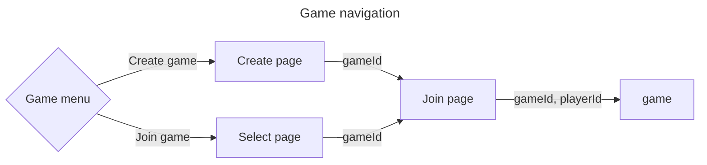
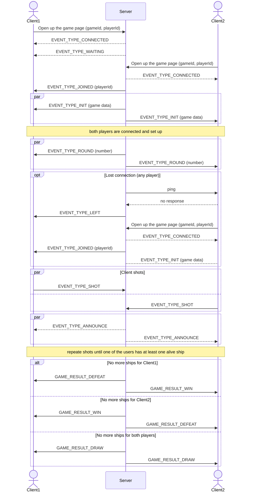

# Battleships

> Battleships (also known as Battleship or Sea Battle) is a strategy type guessing game for two players. It is played on ruled grids (paper or board) on which each player's fleet of warships are marked. The locations of the fleets are concealed from the other player. Players alternate turns calling "shots" at the other player's ships, and the objective of the game is to destroy the opposing player's fleet.
> --  <cite>[Wikipedia](https://en.wikipedia.org/wiki/Battleship_(game))</cite>

## Rules

* two players
* there should be at least one cell gap between ships
* the ships combination is the same for each player
* each round lasts a given amount of time
* both players make a shot each round; there isn't first or last shot; there is only round shot
* if a player run out of time they skip the round

## Game navigation

Main menu offers two options:
* Create game - create new game with desirable settings
* Join game - join an existing game

## Game setting

* visibility (public/private)
* board size
* ships configuration
* round timeout

## Ship types

| Ship | Size |
| -------- | ------- |
| Carrier | 5 |
| Battleship | 4 |
| Destroyer | 3 |
| Submarine | 3 |
| Patrol Boat | 2 |

[//]: # (do we need mine? the lucky may unveil 8 cells at once)
[//]: # (why Destroyer and Submarine simultaneously?)

## Gameflow

## TODO
* Improve AI
* Implement round timer (?)
* Add Restart Game feature (?)
* Use permanent storage (?)

## Terminology

* ships board - board where player's ships and opponent's shots are shown
* shots board - board where a player makes shots on
* round - game phase when both players make shots
* announce - game phase when both players get their shot result in current round