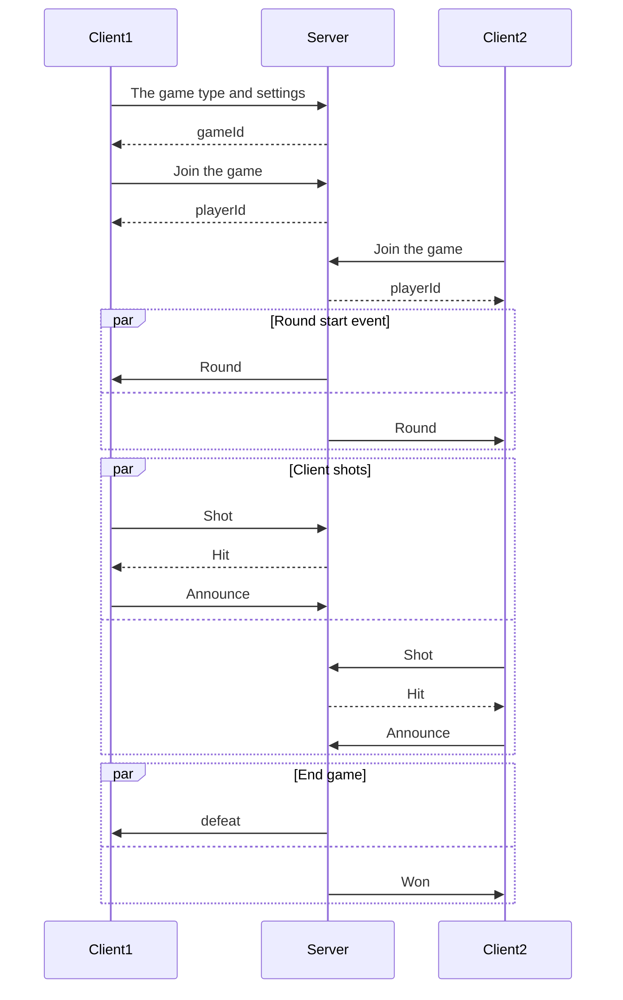

# Battleships

> Battleships (also known as Battleship or Sea Battle) is a strategy type guessing game for two players. It is played on ruled grids (paper or board) on which each player's fleet of warships are marked. The locations of the fleets are concealed from the other player. Players alternate turns calling "shots" at the other player's ships, and the objective of the game is to destroy the opposing player's fleet.
> --  <cite>[Wikipedia](https://en.wikipedia.org/wiki/Battleship_(game))</cite>

## Rules

* two players; make shots wihin each round
* each round lasts a given time
* if a player run out of time they skip the round
* there should be at least one cell between each ship
* the types and numbers of ships allowed are the same for each player.

[//]: # (is there "first" and "last"? if both lost their fleet last round, who wins? Draw?)

## Ship types

| Ship | Size |
| -------- | ------- |
| Carrier | 5 |
| Battleship | 4 |
| Destroyer | 3 |
| Submarine | 3 |
| Patrol Boat | 2 |

[//]: # (do we need mine? the lucky may unveil 8 cells at once)
[//]: # (why Destroyer and Submarine simultaneously?)

## The game types

1. Single player
2. Play with a stranger
3. Play with a friend

## Gameflow

## TODO
1. Announce the results only when both players have made shots
2. Unveil enemy ships on Defeat event
3. One session only (check if socketId is the expected one)
4. GAME_IS_FULL event
5. Keep game settings on server
6. Bad domain models (mixed data and representation)