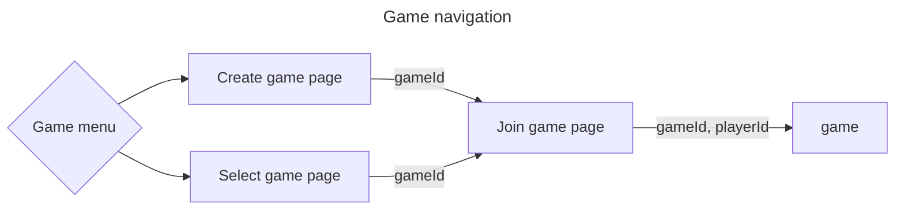
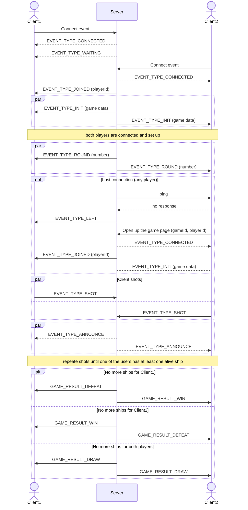

# Battleships

> Battleships (also known as Battleship or Sea Battle) is a strategy type guessing game for two players. It is played on ruled grids (paper or board) on which each player's fleet of warships are marked. The locations of the fleets are concealed from the other player. Players alternate turns calling "shots" at the other player's ships, and the objective of the game is to destroy the opposing player's fleet.
> --  <cite>[Wikipedia](https://en.wikipedia.org/wiki/Battleship_(game))</cite>

It is hosted at http://ec2-18-217-5-14.us-east-2.compute.amazonaws.com:3000

## Rules

* two players
* there should be at least one cell gap between ships
* the ships combination (number and types) is the same for each player
* both players make a shot each round; there isn't the first and the last who shot

## Game navigation

Main menu offers two options:
* Create game - create new game with desirable settings
* Join game - join an existing game which was created by somebody else

## Create game page

### Game types
* single game - game with a AI
* multiplayer - game with another person
    * public - this game will appear on "Join game" page
    * private - this game won't be visible on "Join game" page

### Game settings

You can choose between hardcoded and custom game settings values

* board size
* ships configuration - how many and which ships will be in the game

#### Ship types

| Ship | Size |
| -------- | ------- |
| Carrier | 5 |
| Battleship | 4 |
| Destroyer | 3 |
| Patrol Boat | 2 |

[//]: # (do we need mine? the lucky may unveil 8 cells at once)

## Join game page

Once the game was created it is known information which ships are there and the board size. It is time to put the ships in place. You can move them around the board and rotate. Also `Shuffle` feature is available which lets to get randomly placed ships.

## Gameflow

## TODO
* Disable Rotate button when it isn't possible to rotate the ship
* Improve AI (make shots into intersections which have most ship probability)
* Implement round timer (?)
* Add Restart Game feature (?)
* Use permanent storage (?)

## Terminology

* ships board - board where player's ships and opponent's shots are shown
* shots board - board where a player makes shots on
* round - game phase when both players make shots
* announce - game phase when both players get their shot result in current round
